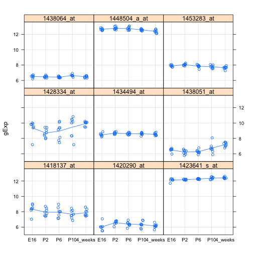

Seminar 5
========================================================

### Libraries


```r
library(lattice)
library(car)
```

```
## Warning: package 'car' was built under R version 3.0.2
```


### Reusable functions


```r
prepareData <- function(x) {
    pDatDes <- cbind(t(prDat[x, ]), prDes)
    pDat <- with(pDatDes, data.frame(sidChar, sidNum, devStage = factor(devStage, 
        levels = as.character(unique(devStage))), gType = factor(gType, levels = as.character(unique(gType))), 
        gExp = c(unlist(pDatDes[, grepl(".*at", colnames(pDatDes))])), gene = factor(rep(grep(".*at", 
            colnames(pDatDes), value = TRUE), each = nrow(pDatDes))), stringsAsFactors = FALSE))
    row.names(pDat) <- seq(1:nrow(pDat))
    pDat
}
```


```r
makeStripplot <- function(data, group = data$gType, type = c("p", "a")) {
    stripplot(gExp ~ devStage | gene, data, group = group, jitter.data = TRUE, 
        auto.key = TRUE, type = type, grid = TRUE)
}
```


### Warm-up exercises

Load the data as usual

```r
prDes <- read.table("../GSE4051_design.tsv", header = TRUE, as.is = TRUE)
prDat <- read.table("../GSE4051_data.tsv")
```


Prepare and plot data for probeset "1456341_a_at"

```r
testDat <- prepareData("1456341_a_at")
str(testDat)
```

```
## 'data.frame':	39 obs. of  6 variables:
##  $ sidChar : chr  "Sample_20" "Sample_21" "Sample_22" "Sample_23" ...
##  $ sidNum  : int  20 21 22 23 16 17 6 24 25 26 ...
##  $ devStage: Factor w/ 5 levels "E16","P2","P6",..: 1 1 1 1 1 1 1 2 2 2 ...
##  $ gType   : Factor w/ 2 levels "wt","NrlKO": 1 1 1 1 2 2 2 1 1 1 ...
##  $ gExp    : num  7.04 7.48 7.37 6.94 6.16 ...
##  $ gene    : Factor w/ 1 level "1456341_a_at": 1 1 1 1 1 1 1 1 1 1 ...
```

```r
makeStripplot(testDat)
```

 


Conduct t-test for probeset "1456341_a_at" at developmental stage P2 vs. 4 weeks post-natal

```r
t.test(x = subset(testDat, devStage == "P2", select = c("gExp")), y = subset(testDat, 
    devStage == "4_weeks", select = c("gExp")))
```

```
## 
## 	Welch Two Sample t-test
## 
## data:  subset(testDat, devStage == "P2", select = c("gExp")) and subset(testDat, devStage == "4_weeks", select = c("gExp"))
## t = -18.84, df = 13.98, p-value = 2.477e-11
## alternative hypothesis: true difference in means is not equal to 0
## 95 percent confidence interval:
##  -4.078 -3.244
## sample estimates:
## mean of x mean of y 
##     6.326     9.987
```


Linear model for one categorical covariate (probeset "1438786_a_at")

```r
testDat2 <- prepareData("1438786_a_at")
makeStripplot(testDat2)
```

 

```r
mfit <- lm(formula = gExp ~ devStage, data = testDat2, subset = gType == "wt")
```


Use this model to compare P2 and P10

```r
contMat <- c(0, 1, 0, -1, 0)
diff <- contMat %*% coef(mfit)
estSe <- t(contMat) %*% vcov(mfit) %*% contMat
testStat <- diff/estSe
2 * pt(abs(testStat), df = df.residual(mfit), lower.tail = FALSE)
```

```
##        [,1]
## [1,] 0.3993
```


Two categorical covariates: devStage and gType (probeset "1448690_at")

```r
makeStripplot(oDat <- prepareData("1448690_at"))
```

 

```r
oFitBig <- lm(formula = gExp ~ devStage * gType, data = oDat)
summary(oFitBig)$coef
```

```
##                            Estimate Std. Error  t value  Pr(>|t|)
## (Intercept)                 8.67800     0.3987 21.76755 1.634e-19
## devStageP2                 -1.02900     0.5638 -1.82512 7.830e-02
## devStageP6                 -1.91450     0.5638 -3.39571 2.003e-03
## devStageP10                -2.19325     0.5638 -3.89012 5.387e-04
## devStage4_weeks            -2.08200     0.5638 -3.69280 9.149e-04
## gTypeNrlKO                 -0.84233     0.6090 -1.38320 1.772e-01
## devStageP2:gTypeNrlKO       0.06983     0.8299  0.08415 9.335e-01
## devStageP6:gTypeNrlKO       0.16533     0.8299  0.19922 8.435e-01
## devStageP10:gTypeNrlKO      0.22583     0.8299  0.27212 7.875e-01
## devStage4_weeks:gTypeNrlKO  0.64608     0.8299  0.77852 4.426e-01
```

```r
oFitSmall <- lm(formula = gExp ~ devStage + gType, data = oDat)
summary(oFitSmall)$coef
```

```
##                 Estimate Std. Error t value  Pr(>|t|)
## (Intercept)       8.5803     0.3046  28.165 1.177e-24
## devStageP2       -1.0104     0.3924  -2.575 1.470e-02
## devStageP6       -1.8481     0.3924  -4.710 4.328e-05
## devStageP10      -2.0966     0.3924  -5.343 6.703e-06
## devStage4_weeks  -1.7752     0.3924  -4.524 7.444e-05
## gTypeNrlKO       -0.6144     0.2430  -2.528 1.643e-02
```

```r
anova(oFitSmall, oFitBig)
```

```
## Analysis of Variance Table
## 
## Model 1: gExp ~ devStage + gType
## Model 2: gExp ~ devStage * gType
##   Res.Df  RSS Df Sum of Sq   F Pr(>F)
## 1     33 18.9                        
## 2     29 18.4  4     0.497 0.2   0.94
```


Repeating the above for probeset 1429225_at

```r
makeStripplot(oDat <- prepareData("1429225_at"))
```

 

```r
oFitBig <- lm(formula = gExp ~ devStage * gType, data = oDat)
summary(oFitBig)$coef
```

```
##                            Estimate Std. Error t value  Pr(>|t|)
## (Intercept)                  7.3125     0.2617 27.9391 1.619e-22
## devStageP2                  -1.1583     0.3701 -3.1292 3.973e-03
## devStageP6                  -1.2495     0.3701 -3.3757 2.110e-03
## devStageP10                 -1.0718     0.3701 -2.8955 7.125e-03
## devStage4_weeks             -0.9088     0.3701 -2.4551 2.032e-02
## gTypeNrlKO                  -0.2602     0.3998 -0.6507 5.203e-01
## devStageP2:gTypeNrlKO        0.2804     0.5448  0.5147 6.107e-01
## devStageP6:gTypeNrlKO        0.7589     0.5448  1.3929 1.742e-01
## devStageP10:gTypeNrlKO       1.7914     0.5448  3.2880 2.648e-03
## devStage4_weeks:gTypeNrlKO   2.2389     0.5448  4.1094 2.970e-04
```

```r
oFitSmall <- lm(formula = gExp ~ devStage + gType, data = oDat)
summary(oFitSmall)$coef
```

```
##                 Estimate Std. Error t value  Pr(>|t|)
## (Intercept)       6.8652     0.2722 25.2199 3.848e-23
## devStageP2       -1.0926     0.3506 -3.1161 3.780e-03
## devStageP6       -0.9446     0.3506 -2.6940 1.101e-02
## devStageP10      -0.2506     0.3506 -0.7147 4.798e-01
## devStage4_weeks   0.1362     0.3506  0.3883 7.003e-01
## gTypeNrlKO        0.7836     0.2172  3.6085 1.007e-03
```

```r
anova(oFitSmall, oFitBig)
```

```
## Analysis of Variance Table
## 
## Model 1: gExp ~ devStage + gType
## Model 2: gExp ~ devStage * gType
##   Res.Df   RSS Df Sum of Sq    F Pr(>F)    
## 1     33 15.12                             
## 2     29  7.95  4      7.17 6.54  7e-04 ***
## ---
## Signif. codes:  0 '***' 0.001 '**' 0.01 '*' 0.05 '.' 0.1 ' ' 1
```


### Take home exercise 1

Now, let's do this for lots of genes

```r
set.seed(340)
samp <- sample(1:nrow(prDat), size = 9, replace = FALSE)
luckyGenes <- rownames(prDat)[samp]
nineGeneDat <- prepareData(luckyGenes)
makeStripplot(nineGeneDat)
```

 


1428334_at looks interesting - could there be an interaction? Let's do some tests...

```r
oFitBig <- with(nineGeneDat, by(nineGeneDat, gene, function(x) lm(formula = gExp ~ 
    devStage * gType, data = x)))
oFitSmall <- with(nineGeneDat, by(nineGeneDat, gene, function(x) lm(formula = gExp ~ 
    devStage + gType, data = x)))
coefsBig <- lapply(oFitBig, function(x) summary(x)$coef)
coefsSmall <- lapply(oFitSmall, function(x) summary(x)$coef)
nums <- seq(1:9)
lapply(nums, function(x) anova(oFitSmall[[x]], oFitBig[[x]]))
```

```
## [[1]]
## Analysis of Variance Table
## 
## Model 1: gExp ~ devStage + gType
## Model 2: gExp ~ devStage * gType
##   Res.Df   RSS Df Sum of Sq    F Pr(>F)
## 1     33 10.07                         
## 2     29  8.24  4      1.83 1.61    0.2
## 
## [[2]]
## Analysis of Variance Table
## 
## Model 1: gExp ~ devStage + gType
## Model 2: gExp ~ devStage * gType
##   Res.Df  RSS Df Sum of Sq    F Pr(>F)
## 1     33 4.31                         
## 2     29 3.77  4     0.536 1.03   0.41
## 
## [[3]]
## Analysis of Variance Table
## 
## Model 1: gExp ~ devStage + gType
## Model 2: gExp ~ devStage * gType
##   Res.Df   RSS Df Sum of Sq    F Pr(>F)  
## 1     33 0.450                           
## 2     29 0.304  4     0.146 3.49  0.019 *
## ---
## Signif. codes:  0 '***' 0.001 '**' 0.01 '*' 0.05 '.' 0.1 ' ' 1
## 
## [[4]]
## Analysis of Variance Table
## 
## Model 1: gExp ~ devStage + gType
## Model 2: gExp ~ devStage * gType
##   Res.Df  RSS Df Sum of Sq    F Pr(>F)
## 1     33 27.6                         
## 2     29 21.6  4      5.94 1.99   0.12
## 
## [[5]]
## Analysis of Variance Table
## 
## Model 1: gExp ~ devStage + gType
## Model 2: gExp ~ devStage * gType
##   Res.Df   RSS Df Sum of Sq    F Pr(>F)
## 1     33 0.897                         
## 2     29 0.851  4    0.0459 0.39   0.81
## 
## [[6]]
## Analysis of Variance Table
## 
## Model 1: gExp ~ devStage + gType
## Model 2: gExp ~ devStage * gType
##   Res.Df  RSS Df Sum of Sq    F Pr(>F)
## 1     33 4.43                         
## 2     29 4.12  4     0.304 0.53   0.71
## 
## [[7]]
## Analysis of Variance Table
## 
## Model 1: gExp ~ devStage + gType
## Model 2: gExp ~ devStage * gType
##   Res.Df   RSS Df Sum of Sq    F Pr(>F)
## 1     33 0.590                         
## 2     29 0.481  4     0.109 1.64   0.19
## 
## [[8]]
## Analysis of Variance Table
## 
## Model 1: gExp ~ devStage + gType
## Model 2: gExp ~ devStage * gType
##   Res.Df   RSS Df Sum of Sq    F Pr(>F)   
## 1     33 1.038                            
## 2     29 0.659  4     0.379 4.17 0.0086 **
## ---
## Signif. codes:  0 '***' 0.001 '**' 0.01 '*' 0.05 '.' 0.1 ' ' 1
## 
## [[9]]
## Analysis of Variance Table
## 
## Model 1: gExp ~ devStage + gType
## Model 2: gExp ~ devStage * gType
##   Res.Df   RSS Df Sum of Sq   F Pr(>F)  
## 1     33 0.948                          
## 2     29 0.720  4     0.229 2.3  0.082 .
## ---
## Signif. codes:  0 '***' 0.001 '**' 0.01 '*' 0.05 '.' 0.1 ' ' 1
```


Seems that 3 and 8 (1423641_s_at and 1448504_a_at) have the most evidence for an interaction effect. Not what I would have expected from looking at the plots.

### Take home exercise 2

Let's keep working with our set of nine genes. Let's transform the devStage column into a numeric type column called age.

```r
nineGeneDat$age <- recode(nineGeneDat$devStage, "'E16'=-2; 'P2'=2; 'P6'=6; 'P10'=10; '4_weeks'=28", 
    as.factor.result = FALSE)
oFitAge <- with(nineGeneDat, by(nineGeneDat, gene, function(x) lm(formula = gExp ~ 
    age, data = x)))
oFitAgeQuad <- with(nineGeneDat, by(nineGeneDat, gene, function(x) lm(formula = gExp ~ 
    age + I(age^2), data = x)))
coefsAge <- lapply(oFitAge, function(x) summary(x)$coef)
coefsQuad <- lapply(oFitAgeQuad, function(x) summary(x)$coef)
lapply(nums, function(x) anova(oFitAge[[x]], oFitAgeQuad[[x]]))
```

```
## [[1]]
## Analysis of Variance Table
## 
## Model 1: gExp ~ age
## Model 2: gExp ~ age + I(age^2)
##   Res.Df  RSS Df Sum of Sq    F Pr(>F)  
## 1     37 11.5                           
## 2     36 10.3  1      1.11 3.84  0.058 .
## ---
## Signif. codes:  0 '***' 0.001 '**' 0.01 '*' 0.05 '.' 0.1 ' ' 1
## 
## [[2]]
## Analysis of Variance Table
## 
## Model 1: gExp ~ age
## Model 2: gExp ~ age + I(age^2)
##   Res.Df  RSS Df Sum of Sq    F Pr(>F)  
## 1     37 5.75                           
## 2     36 5.29  1     0.464 3.16  0.084 .
## ---
## Signif. codes:  0 '***' 0.001 '**' 0.01 '*' 0.05 '.' 0.1 ' ' 1
## 
## [[3]]
## Analysis of Variance Table
## 
## Model 1: gExp ~ age
## Model 2: gExp ~ age + I(age^2)
##   Res.Df   RSS Df Sum of Sq    F Pr(>F)  
## 1     37 0.584                           
## 2     36 0.504  1    0.0799 5.71  0.022 *
## ---
## Signif. codes:  0 '***' 0.001 '**' 0.01 '*' 0.05 '.' 0.1 ' ' 1
## 
## [[4]]
## Analysis of Variance Table
## 
## Model 1: gExp ~ age
## Model 2: gExp ~ age + I(age^2)
##   Res.Df  RSS Df Sum of Sq    F Pr(>F)
## 1     37 31.9                         
## 2     36 31.4  1     0.482 0.55   0.46
## 
## [[5]]
## Analysis of Variance Table
## 
## Model 1: gExp ~ age
## Model 2: gExp ~ age + I(age^2)
##   Res.Df  RSS Df Sum of Sq    F Pr(>F)
## 1     37 1.09                         
## 2     36 1.01  1    0.0771 2.74   0.11
## 
## [[6]]
## Analysis of Variance Table
## 
## Model 1: gExp ~ age
## Model 2: gExp ~ age + I(age^2)
##   Res.Df  RSS Df Sum of Sq   F Pr(>F)
## 1     37 5.78                        
## 2     36 5.61  1     0.172 1.1    0.3
## 
## [[7]]
## Analysis of Variance Table
## 
## Model 1: gExp ~ age
## Model 2: gExp ~ age + I(age^2)
##   Res.Df   RSS Df Sum of Sq    F Pr(>F)
## 1     37 0.811                         
## 2     36 0.776  1    0.0348 1.61   0.21
## 
## [[8]]
## Analysis of Variance Table
## 
## Model 1: gExp ~ age
## Model 2: gExp ~ age + I(age^2)
##   Res.Df  RSS Df Sum of Sq    F Pr(>F)
## 1     37 1.28                         
## 2     36 1.24  1    0.0375 1.09    0.3
## 
## [[9]]
## Analysis of Variance Table
## 
## Model 1: gExp ~ age
## Model 2: gExp ~ age + I(age^2)
##   Res.Df  RSS Df Sum of Sq    F Pr(>F)
## 1     37 1.16                         
## 2     36 1.16  1   0.00115 0.04   0.85
```


Looks like the quadratic term might be improving the model significantly in case 3, and maybe 1 and 2 depending one what threshold you set. This seems a bit strange given the plot:

```r
makeStripplot(nineGeneDat, group = NULL)
```

 


### Take home exercise 3

Now let's try this again after removing 4 weeks.

```r
nineGeneDatFilt <- nineGeneDat[nineGeneDat$devStage != "4_weeks", ]
oFitAgeFilt <- with(nineGeneDatFilt, by(nineGeneDatFilt, gene, function(x) lm(formula = gExp ~ 
    age, data = x)))
oFitAgeQuadFilt <- with(nineGeneDatFilt, by(nineGeneDatFilt, gene, function(x) lm(formula = gExp ~ 
    age + I(age^2), data = x)))
coefsAgeFilt <- lapply(oFitAgeFilt, function(x) summary(x)$coef)
coefsQuadFilt <- lapply(oFitAgeQuadFilt, function(x) summary(x)$coef)
lapply(nums, function(x) anova(oFitAgeFilt[[x]], oFitAgeQuadFilt[[x]]))
```

```
## [[1]]
## Analysis of Variance Table
## 
## Model 1: gExp ~ age
## Model 2: gExp ~ age + I(age^2)
##   Res.Df  RSS Df Sum of Sq    F Pr(>F)
## 1     29 9.11                         
## 2     28 9.07  1    0.0406 0.13   0.73
## 
## [[2]]
## Analysis of Variance Table
## 
## Model 1: gExp ~ age
## Model 2: gExp ~ age + I(age^2)
##   Res.Df  RSS Df Sum of Sq    F Pr(>F)  
## 1     29 4.94                           
## 2     28 4.25  1     0.693 4.56  0.042 *
## ---
## Signif. codes:  0 '***' 0.001 '**' 0.01 '*' 0.05 '.' 0.1 ' ' 1
## 
## [[3]]
## Analysis of Variance Table
## 
## Model 1: gExp ~ age
## Model 2: gExp ~ age + I(age^2)
##   Res.Df   RSS Df Sum of Sq    F Pr(>F)
## 1     29 0.427                         
## 2     28 0.421  1    0.0057 0.38   0.54
## 
## [[4]]
## Analysis of Variance Table
## 
## Model 1: gExp ~ age
## Model 2: gExp ~ age + I(age^2)
##   Res.Df  RSS Df Sum of Sq    F Pr(>F)
## 1     29 31.1                         
## 2     28 28.4  1      2.75 2.71   0.11
## 
## [[5]]
## Analysis of Variance Table
## 
## Model 1: gExp ~ age
## Model 2: gExp ~ age + I(age^2)
##   Res.Df   RSS Df Sum of Sq   F Pr(>F)  
## 1     29 0.856                          
## 2     28 0.771  1    0.0852 3.1  0.089 .
## ---
## Signif. codes:  0 '***' 0.001 '**' 0.01 '*' 0.05 '.' 0.1 ' ' 1
## 
## [[6]]
## Analysis of Variance Table
## 
## Model 1: gExp ~ age
## Model 2: gExp ~ age + I(age^2)
##   Res.Df  RSS Df Sum of Sq    F Pr(>F)  
## 1     29 5.21                           
## 2     28 4.21  1     0.998 6.64  0.016 *
## ---
## Signif. codes:  0 '***' 0.001 '**' 0.01 '*' 0.05 '.' 0.1 ' ' 1
## 
## [[7]]
## Analysis of Variance Table
## 
## Model 1: gExp ~ age
## Model 2: gExp ~ age + I(age^2)
##   Res.Df   RSS Df Sum of Sq    F Pr(>F)  
## 1     29 0.642                           
## 2     28 0.515  1     0.127 6.93  0.014 *
## ---
## Signif. codes:  0 '***' 0.001 '**' 0.01 '*' 0.05 '.' 0.1 ' ' 1
## 
## [[8]]
## Analysis of Variance Table
## 
## Model 1: gExp ~ age
## Model 2: gExp ~ age + I(age^2)
##   Res.Df   RSS Df Sum of Sq    F Pr(>F)   
## 1     29 0.919                            
## 2     28 0.720  1     0.199 7.75 0.0095 **
## ---
## Signif. codes:  0 '***' 0.001 '**' 0.01 '*' 0.05 '.' 0.1 ' ' 1
## 
## [[9]]
## Analysis of Variance Table
## 
## Model 1: gExp ~ age
## Model 2: gExp ~ age + I(age^2)
##   Res.Df   RSS Df Sum of Sq    F Pr(>F)  
## 1     29 0.906                           
## 2     28 0.813  1    0.0931 3.21  0.084 .
## ---
## Signif. codes:  0 '***' 0.001 '**' 0.01 '*' 0.05 '.' 0.1 ' ' 1
```


Now the quadratic model looks promising for a few more of the genes.

### Take home exercise 4

Now let's add regression lines to the strip plots.

```r
makeStripplot(nineGeneDat, NULL, c("p", "r"))
```

 


