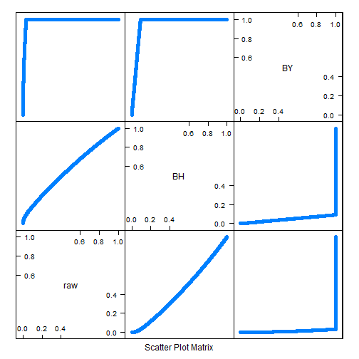

Seminar 6
========================================================

### Libraries


```r
library(lattice)
library(limma)
```


### Reusable functions


```r
prepareData <- function(x) {
    pDatDes <- cbind(t(prDat[x, ]), prDes)
    pDat <- with(pDatDes, data.frame(sidChar, sidNum, devStage = factor(devStage, 
        levels = as.character(unique(devStage))), gType = factor(gType, levels = as.character(unique(gType))), 
        gExp = c(unlist(pDatDes[, grepl(".*at", colnames(pDatDes))])), gene = factor(rep(grep(".*at", 
            colnames(pDatDes), value = TRUE), each = nrow(pDatDes))), stringsAsFactors = FALSE))
    row.names(pDat) <- seq(1:nrow(pDat))
    pDat
}
```


```r
makeStripplot <- function(data, group = data$gType, type = c("p", "a")) {
    stripplot(gExp ~ devStage | gene, data, group = group, jitter.data = TRUE, 
        auto.key = TRUE, type = type, grid = TRUE)
}
```


Stolen from Sohrab...

```r
niceScatter <- function(x.var, y.var, x.label, y.label) {
    lims <- c(-20, 15)
    xyplot(y.var ~ x.var, asp = 1, panel = function(x, y, ...) {
        panel.smoothScatter(x, y, ...)
        panel.abline(0, 1, col = "orange")
    }, nbin = 150, ylim = lims, xlim = lims, xlab = x.label, ylab = y.label)
}
```


### Fit a linear model

Load the data as usual.

```r
prDes <- readRDS("../GSE4051_design.rds")
prDat <- read.table("../GSE4051_data.tsv")
```


Fit a linear model to the wildtype data.

```r
wtDes <- subset(prDes, gType == "wt")
wtDat <- subset(prDat, select = prDes$gType == "wt")
wtDesMat <- model.matrix(~devStage, wtDes)
wtFit <- lmFit(wtDat, wtDesMat)
wtEbFit <- eBayes(wtFit)
```


Find differentially expressed genes.

```r
topTable(wtEbFit)
```

```
##              X.Intercept. devStageP2 devStageP6 devStageP10
## 1423641_s_at        12.18    -0.0175     0.0750      0.0675
## 1438940_x_at        12.86     0.0850     0.1325      0.3425
## 1438657_x_at        12.78     0.1400     0.1250     -0.1850
## 1456736_x_at        12.32     0.1625     0.3050      0.2075
## 1436884_x_at        12.93     0.1775     0.3225      0.0300
## 1419700_a_at        12.32     0.1650     0.6475      0.8175
## 1435800_a_at        12.28     0.0450     0.6825      0.9000
## 1454613_at          12.47    -0.1075    -0.0500     -0.1025
## 1451240_a_at        13.00     0.3100     0.2800      0.2800
## 1450084_s_at        12.63     0.0825     0.0525      0.1725
##              devStage4_weeks AveExpr     F   P.Value adj.P.Val
## 1423641_s_at          0.1800   12.24 45350 3.574e-36 5.201e-32
## 1438940_x_at          0.3500   13.04 44957 3.865e-36 5.201e-32
## 1438657_x_at         -0.4500   12.71 43486 5.210e-36 5.201e-32
## 1456736_x_at          0.0725   12.47 39509 1.233e-35 6.725e-32
## 1436884_x_at          0.0250   13.04 39269 1.302e-35 6.725e-32
## 1419700_a_at          0.6825   12.78 39121 1.347e-35 6.725e-32
## 1435800_a_at          1.0200   12.81 36668 2.410e-35 1.031e-31
## 1454613_at           -0.3825   12.34 35835 2.962e-35 1.078e-31
## 1451240_a_at         -0.3700   13.10 35481 3.239e-35 1.078e-31
## 1450084_s_at          0.2600   12.75 34411 4.265e-35 1.234e-31
```

```r
dsHits <- topTable(wtEbFit, coef = grep("devStage", colnames(coef(wtEbFit))))
```


Make plots for three of these hits.

```r
pDat <- prepareData(c("1451617_at", "1425222_x_at", "1422929_s_at"))
wtpDat <- subset(pDat, gType == "wt")
makeStripplot(wtpDat, group = NULL)
```

 

These plots highlight the differential expression of these genes across dev stages.

This seems to support the hypothesis that devstage has an effect on its own.

Compare to lm.

```r
# Get lm results for 1451617_at
wtFitlm <- lm(gExp ~ devStage, wtpDat[1:35, ])

summary(wtFitlm)$coef
```

```
##                 Estimate Std. Error t value  Pr(>|t|)
## (Intercept)       5.5555     0.4245  13.086 6.218e-14
## devStageP2        0.8038     0.6004   1.339 1.907e-01
## devStageP6        1.6561     0.6004   2.758 9.799e-03
## devStageP10       3.5806     0.6215   5.762 2.720e-06
## devStage4_weeks   6.9645     0.7353   9.471 1.597e-10
```

```r
dsHits["1451617_at", ]
```

```
##            devStageP2 devStageP6 devStageP10 devStage4_weeks AveExpr     F
## 1451617_at     0.7255      2.513       4.984           6.685   8.817 136.5
##              P.Value adj.P.Val
## 1451617_at 3.485e-13  1.16e-09
```


It's hard to compare these two because lm assigns a p-value to each coef whereas limma assigns a p-value to the probe across all values of devstage. However, they seem to be in the same ballpark.

### topTable exercises

How many probes have Benjamini-Hochberg ("BH") adjusted p-values for the F test conducted above that are less than 1e-05?

```r
BHtab <- topTable(wtEbFit, coef = grep("devStage", colnames(coef(wtEbFit))), 
    number = Inf, adjust.method = "BH", p.value = 1e-05)
nrow(BHtab)
```

```
## [1] 350
```


What is the 63rd hit on this list?

```r
BHtab[63, c("F", "adj.P.Val", "devStageP6")]
```

```
##                  F adj.P.Val devStageP6
## 1451633_a_at 64.01 1.049e-07      2.069
```


Scatterplot the t statistics for the test that the P2 effect is zero against that for P10.

```r
P2tab <- topTable(wtEbFit, coef = grep("devStageP2", colnames(coef(wtEbFit))), 
    number = Inf, sort.by = "none")
P10tab <- topTable(wtEbFit, coef = grep("devStageP10", colnames(coef(wtEbFit))), 
    number = Inf, sort.by = "none")
niceScatter(P2tab$t, P10tab$t, "P2 t-stat", "P10 t-stat")
```

```
## KernSmooth 2.23 loaded
## Copyright M. P. Wand 1997-2009
## (loaded the KernSmooth namespace)
```

 


Create a densityplot of the associated adjusted p-values.

```r
densityplot(~P2tab$adj.P.Val + P10tab$adj.P.Val, auto.key = TRUE)
```

 


If you require a BH adjusted p-value less than 1e-03, how many hits do you get for P2? How many for P10? How much overlap is there?

```r
addmargins(table(P2tab$adj.P.Val < 0.001, P10tab$adj.P.Val < 0.001, dnn = c("P2", 
    "P10")))
```

```
##        P10
## P2      FALSE  TRUE   Sum
##   FALSE 29201   695 29896
##   TRUE      1    52    53
##   Sum   29202   747 29949
```


Now just focus on the P10 effect. Create a scatterplot matrix of raw p-values, BH adjusted p-values, and BY p-values.

```r
P10tab_BY <- topTable(wtEbFit, coef = grep("devStageP10", colnames(coef(wtEbFit))), 
    number = Inf, adjust.method = "BY", sort = "none")
splomDat <- data.frame(raw = P10tab$P.Value, BH = P10tab$adj.P.Val, BY = P10tab_BY$adj.P.Val)
splom(splomDat)
```

 

The BH values are almost linearly related to the raw values, although they ascend somewhat faster.

### Perform inference for some contrasts.

Set up contrasts.

```r
cont.matrix <- makeContrasts(P10VsP6 = devStageP10 - devStageP6, fourweeksVsP10 = devStage4_weeks - 
    devStageP10, levels = wtDesMat)
```

```
## Warning: Renaming (Intercept) to Intercept
```

```r
wtFitCont <- contrasts.fit(wtFit, cont.matrix)
```

```
## Warning: row names of contrasts don't match col names of coefficients
```

```r
wtEbFitCont <- eBayes(wtFitCont)
contTab <- topTable(wtEbFitCont)
contTab
```

```
##              P10VsP6 fourweeksVsP10 AveExpr     F   P.Value adj.P.Val
## 1440645_at    0.7247          3.041   6.528 632.7 2.224e-17 6.662e-13
## 1416041_at   -0.1470          4.782   9.383 302.4 1.473e-14 2.206e-10
## 1425222_x_at  0.7493          3.983   7.028 235.4 1.300e-13 1.297e-09
## 1424852_at    0.3443          3.405   7.454 225.1 1.910e-13 1.430e-09
## 1420726_x_at  0.1733          3.551   7.190 203.5 4.555e-13 2.640e-09
## 1451635_at    0.8260          4.172   8.319 200.0 5.289e-13 2.640e-09
## 1429394_at   -0.0980          2.410   7.848 167.5 2.416e-12 1.034e-08
## 1455447_at   -0.9765         -1.800   9.973 153.5 5.063e-12 1.896e-08
## 1429791_at    0.2480          1.658   8.026 145.7 7.877e-12 2.621e-08
## 1422612_at    0.4838          3.426   8.833 142.2 9.676e-12 2.840e-08
```


Plot the data from the top 4 hits.

```r
pDat <- prepareData(rownames(contTab)[1:4])
wtpDat <- subset(pDat, gType == "wt")
makeStripplot(wtpDat, group = NULL)
```

 


Let's use decideTests() to adjust the p-values for both contrasts globally, i.e. all together and then threshhold them at a cutoff of 1e-04.

```r
cutoff <- 1e-04
wtResCont <- decideTests(wtEbFitCont, p.value = cutoff, method = "global")
summary(wtResCont)
```

```
##    P10VsP6 fourweeksVsP10
## -1       4              8
## 0    29945          29895
## 1        0             46
```


Let's try to pull out various hits and plot their data.

```r
hits1 <- rownames(prDat)[which(wtResCont[, "P10VsP6"] < 0)]
hits2 <- rownames(prDat)[which(wtResCont[, "fourweeksVsP10"] < 0)]
hits3 <- rownames(prDat)[which(wtResCont[, "fourweeksVsP10"] > 0)]

pDat_hits1 <- prepareData(hits1)
wtpDat_hits1 <- subset(pDat_hits1, gType == "wt")
makeStripplot(wtpDat_hits1, group = NULL)
```

 

```r

pDat_hits2 <- prepareData(hits2[1:4])
wtpDat_hits2 <- subset(pDat_hits2, gType == "wt")
makeStripplot(wtpDat_hits2, group = NULL)
```

 

```r

pDat_hits3 <- prepareData(hits3[1:4])
wtpDat_hits3 <- subset(pDat_hits3, gType == "wt")
makeStripplot(wtpDat_hits3, group = NULL)
```

 

```r

intersect(hits1, hits2)
```

```
## character(0)
```

```r
intersect(hits1, hits3)
```

```
## character(0)
```

```r
intersect(hits2, hits3)
```

```
## character(0)
```


Repeat with less stringent cut-off.

```r
cutoff <- 0.01
nhits <- 8
wtResCont <- decideTests(wtEbFitCont, p.value = cutoff, method = "global")
summary(wtResCont)
```

```
##    P10VsP6 fourweeksVsP10
## -1      40             49
## 0    29897          29636
## 1       12            264
```

```r
vennDiagram(wtResCont)
```

 

```r

hits1 <- rownames(prDat)[which(wtResCont[, "P10VsP6"] < 0)]
hits2 <- rownames(prDat)[which(wtResCont[, "fourweeksVsP10"] < 0)]
hits3 <- rownames(prDat)[which(wtResCont[, "P10VsP6"] > 0)]
hits4 <- rownames(prDat)[which(wtResCont[, "fourweeksVsP10"] > 0)]
hits5 <- rownames(prDat)[which(wtResCont[, "P10VsP6"] != 0 & wtResCont[, "fourweeksVsP10"] != 
    0)]
hits6 <- rownames(prDat)[which(wtResCont[, "P10VsP6"] > 0 & wtResCont[, "fourweeksVsP10"] < 
    0)]

pDat_hits1 <- prepareData(hits1[1:nhits])
wtpDat_hits1 <- subset(pDat_hits1, gType == "wt")
makeStripplot(wtpDat_hits1, group = NULL)
```

 

```r

pDat_hits2 <- prepareData(hits2[1:nhits])
wtpDat_hits2 <- subset(pDat_hits2, gType == "wt")
makeStripplot(wtpDat_hits2, group = NULL)
```

 

```r

pDat_hits3 <- prepareData(hits3[1:nhits])
wtpDat_hits3 <- subset(pDat_hits3, gType == "wt")
makeStripplot(wtpDat_hits3, group = NULL)
```

 

```r

pDat_hits4 <- prepareData(hits4[1:nhits])
wtpDat_hits4 <- subset(pDat_hits4, gType == "wt")
makeStripplot(wtpDat_hits4, group = NULL)
```

 

```r

pDat_hits5 <- prepareData(hits5)
wtpDat_hits5 <- subset(pDat_hits5, gType == "wt")
makeStripplot(wtpDat_hits5, group = NULL)
```

 

```r

pDat_hits6 <- prepareData(hits6)
wtpDat_hits6 <- subset(pDat_hits6, gType == "wt")
makeStripplot(wtpDat_hits6, group = NULL)
```

 


### Take-home exercise: See if you can find one or more probes that have some expression changes up to P6 and then hold steady all the way to 4_weeks.

Set up contrasts.

```r
cont.matrix <- makeContrasts(P2VsE16 = devStageP2 - Intercept, P6VsP2 = devStageP6 - 
    devStageP2, P10VsP6 = devStageP10 - devStageP6, fourweeksVsP10 = devStage4_weeks - 
    devStageP10, levels = wtDesMat)
```

```
## Warning: Renaming (Intercept) to Intercept
```

```r
wtFitCont <- contrasts.fit(wtFit, cont.matrix)
```

```
## Warning: row names of contrasts don't match col names of coefficients
```

```r
wtEbFitCont <- eBayes(wtFitCont)
contTab <- topTable(wtEbFitCont)
contTab
```

```
##              P2VsE16  P6VsP2    P10VsP6 fourweeksVsP10 AveExpr    F
## 1438657_x_at  -12.64 -0.0150 -3.100e-01        -0.2650   12.71 2641
## 1423641_s_at  -12.20  0.0925 -7.500e-03         0.1125   12.24 2610
## 1438940_x_at  -12.78  0.0475  2.100e-01         0.0075   13.04 2485
## 1436884_x_at  -12.75  0.1450 -2.925e-01        -0.0050   13.04 2226
## 1454613_at    -12.57  0.0575 -5.250e-02        -0.2800   12.34 2212
## 1456736_x_at  -12.16  0.1425 -9.750e-02        -0.1350   12.47 2202
## 1456349_x_at  -11.58 -0.1200 -1.250e-02        -0.3375   11.53 2077
## 1451240_a_at  -12.69 -0.0300 -4.996e-16        -0.6500   13.10 2032
## 1438859_x_at  -13.00 -0.2425 -9.750e-02        -0.3125   12.63 1978
## 1416187_s_at  -12.08 -0.1300 -5.500e-02         0.0825   12.18 1964
##                P.Value adj.P.Val
## 1438657_x_at 1.309e-24 2.179e-20
## 1423641_s_at 1.455e-24 2.179e-20
## 1438940_x_at 2.259e-24 2.256e-20
## 1436884_x_at 6.061e-24 3.329e-20
## 1454613_at   6.413e-24 3.329e-20
## 1456736_x_at 6.669e-24 3.329e-20
## 1456349_x_at 1.125e-23 4.811e-20
## 1451240_a_at 1.369e-23 5.057e-20
## 1438859_x_at 1.744e-23 5.057e-20
## 1416187_s_at 1.858e-23 5.057e-20
```


Try with the more stringent cut-off, since I reckon a lot of probes will meet the criterea (more change expected at beginning, as demonstrated in Venn diagram below).

```r
cutoff <- 1e-04
wtResCont <- decideTests(wtEbFitCont, p.value = cutoff, method = "global")
summary(wtResCont)
```

```
##    P2VsE16 P6VsP2 P10VsP6 fourweeksVsP10
## -1   29903      0      32             37
## 0       46  29937   29907          29712
## 1        0     12      10            200
```

```r
vennDiagram(wtResCont)
```

 

Looks like most of the change is going on between E16 and P2 (this makes sense).

Find probes that meet the conditions - changes at both points before P6 but not after P6.

```r
hits <- rownames(prDat)[which(wtResCont[, "P2VsE16"] != 0 & wtResCont[, "P6VsP2"] != 
    0 & wtResCont[, "P10VsP6"] == 0 & wtResCont[, "fourweeksVsP10"] == 0)]

pDat_hits <- prepareData(hits[1:nhits])
wtpDat_hits <- subset(pDat_hits, gType == "wt")
makeStripplot(wtpDat_hits, group = NULL)
```

 

